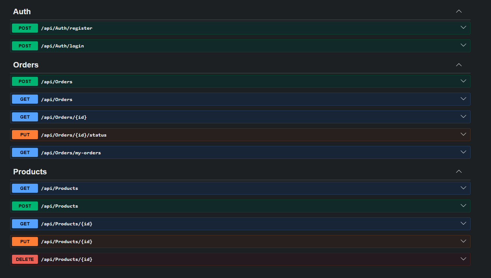
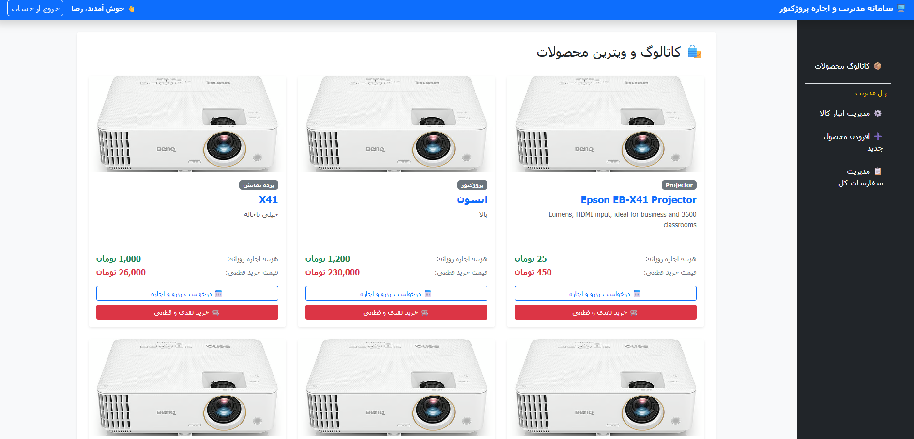
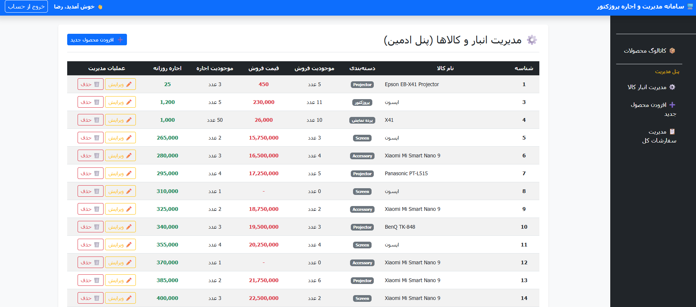
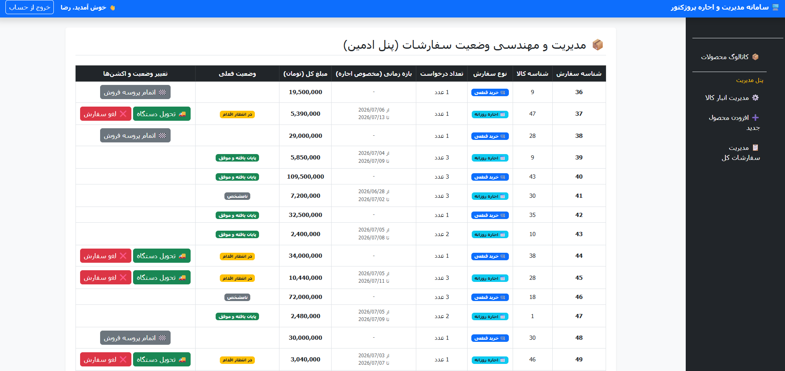
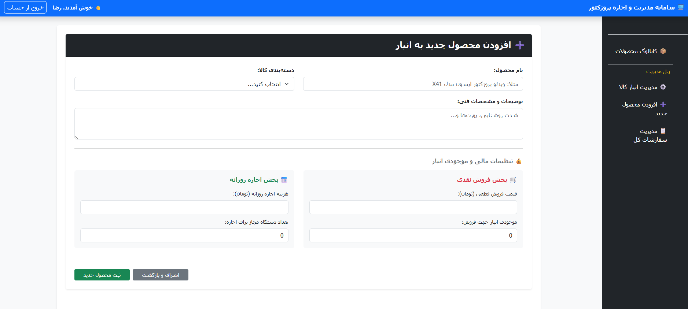

# Video Projector Rental & Sales Management System

A modern, distributed, and object-oriented platform designed for managing, purchasing, and daily renting of video projectors and accessories. Built with a robust client-server architecture and advanced role-based security.

---

## Tech Stack

* **Backend:** .NET 10.0 Web API / Entity Framework Core
* **Frontend:** Blazor WebAssembly (WASM) .NET 10.0
* **Database:** Microsoft SQL Server (T-SQL)
* **Security:** JWT Authentication / Role-Based Access Control (RBAC)
* **UI Design:** Bootstrap 5 / Responsive CSS

---

## System Screenshots

Explore the user interface and features developed across different modules of the application:

### Interactive API Documentation (Swagger)
Swagger documentations APIs


### Admin Dashboard
A comprehensive panel for monitoring incoming orders, rental cycles, and overall inventory status.


### User & Access Management
Dedicated module for separating and managing system users based on organizational roles.


### Product Selection & Order Process
A dynamic storefront displaying available equipment, distinct options for daily renting or outright purchasing, and an integrated quality test video link.


### Product Management Form
An intuitive interface allowing administrators to register new projectors complete with specific categories, pricing, stock levels, images, and quality test video URLs.


---

## Key Features

1. **Smart & Dynamic Authentication (JWT-Based Auth):**
   * Implemented a custom `AuthenticationStateProvider` in Blazor WASM.
   * Engineered an instant `HttpClient` authorization header synchronization immediately post-login, completely eliminating the need for manual page refreshes.
2. **Zero-Trust Backend Security:**
   * Extracts user identity (`UserId`) directly from the secure cryptographic signature of the incoming JWT token within backend services, neutralizing payload-tampering or identity-spoofing vulnerabilities.
3. **Role-Based Dynamic UI (RBAC):**
   * Context-aware UI filtering that hides or reveals administrative actions (Add, Edit, Delete buttons) dynamically using Blazor authorization tags depending on the user's role (`Admin` vs. `Customer`).
4. **Custom 403 Access Denial Page:**
   * Customized the fallback `<NotAuthorized>` router component inside `App.razor` to present an elegant, user-friendly access restriction card instead of raw textual errors.
5. **Media-Enhanced Catalog:**
   * Native support for serving local static assets via the backend pipeline (`UseStaticFiles`), accompanied by remote streaming integration for showcasing real-world device performance and video tests.

---

## Setup Guide

### Database Configuration (SQL Server)
Open the `appsettings.json` file inside the **API** project and configure your local connection string:
```json
"ConnectionStrings": {
  "DefaultConnection": "Server=YOUR_SERVER_NAME;Database=ProjectorRentalDb;Trusted_Connection=True;TrustServerCertificate=True;"
}
