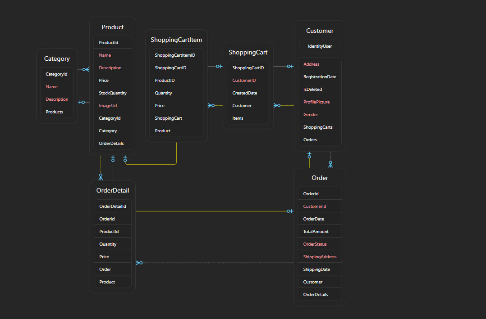

# E-commerce Database Schema Overview

This document describes the key models and their relationships that make up the database schema for a simplified E-commerce application that sells Video Projectors and other related products.

## 1. Customer Model

The Customer model represents users in the system. This model contains essential information about the customer, including login credentials and personal details. It connects to orders and shopping carts associated with each customer.

### Fields:
- **CustomerId (Primary Key)**: Unique identifier for each customer.
- **UserName**: Username for login (provided by Identity).
- **Email**: Customer's email address (unique).
- **PhoneNumber**: Customer's phone number.
- **Address**: Customer's address (for shipping purposes).
- **PasswordHash**: Hashed password stored by Identity (via ASP.NET Core Identity).
- **CreatedAt**: Date and time when the customer was created.

### Relationships:
- **One-to-Many**: A Customer can have many Orders (i.e., one customer can place multiple orders).
- **One-to-One**: A Customer can have one ShoppingCart.

## 2. Product Model

The Product model represents the items available for sale in the store. Each product has information about its price, quantity, and category.

### Fields:
- **ProductId (Primary Key)**: Unique identifier for each product.
- **Name**: Name of the product (e.g., "Video Projector").
- **Description**: Detailed description of the product.
- **Price**: Price of the product.
- **StockQuantity**: The number of items available in stock.
- **ImageUrl**: URL of the product image.
- **CategoryId (Foreign Key)**: Links to the Category model to categorize the product.

### Relationships:
- **Many-to-One**: Many Products can belong to one Category.
- **Many-to-Many**: A Product can be part of many OrderDetails.

## 3. Category Model

The Category model is used to classify products into different types (e.g., "Projectors", "Screens", "Accessories").

### Fields:
- **CategoryId (Primary Key)**: Unique identifier for each category.
- **Name**: Name of the category (e.g., "Projectors").
- **Description**: Description of the category.

### Relationships:
- **One-to-Many**: A Category can have many Products.

## 4. Order Model

The Order model represents a customer's purchase. It tracks the order details such as the total price, order status, and which customer placed the order.

### Fields:
- **OrderId (Primary Key)**: Unique identifier for each order.
- **CustomerId (Foreign Key)**: Links to the Customer model. Each order belongs to one customer.
- **OrderDate**: Date and time when the order was placed.
- **TotalAmount**: Total amount of the order.
- **OrderStatus**: The current status of the order (e.g., "Pending", "Shipped").
- **ShippingAddress**: The address where the order will be shipped.

### Relationships:
- **Many-to-One**: Many Orders can belong to one Customer.
- **One-to-Many**: An Order can have multiple OrderDetails.

## 5. OrderDetail Model

The OrderDetail model tracks which products are included in each order. It also tracks the quantity and price of each product at the time of purchase.

### Fields:
- **OrderDetailId (Primary Key)**: Unique identifier for each order detail entry.
- **OrderId (Foreign Key)**: Links to the Order model. Each order detail belongs to one order.
- **ProductId (Foreign Key)**: Links to the Product model. Each order detail corresponds to a product.
- **Quantity**: The number of units of the product in this order.
- **Price**: The price of the product at the time the order was placed.

### Relationships:
- **Many-to-One**: Many OrderDetails can belong to one Order.
- **Many-to-One**: Many OrderDetails can refer to one Product.

## 6. ShoppingCart Model

The ShoppingCart model tracks the products a customer intends to buy before they finalize their order. It temporarily stores products in the cart and their quantities until the customer proceeds to checkout.

### Fields:
- **ShoppingCartId (Primary Key)**: Unique identifier for each shopping cart.
- **CustomerId (Foreign Key)**: Links to the Customer model. Each shopping cart belongs to one customer.
- **ShoppingCartItems**: A collection of ShoppingCartItem entries representing each product in the cart.

### Relationships:
- **One-to-One**: Each Customer can have one ShoppingCart.
- **One-to-Many**: A ShoppingCart can contain many ShoppingCartItems.

## 7. ShoppingCartItem Model

The ShoppingCartItem model stores individual items in the customer's shopping cart. It contains information about the product and the quantity.

### Fields:
- **ShoppingCartItemId (Primary Key)**: Unique identifier for each item in the shopping cart.
- **ShoppingCartId (Foreign Key)**: Links to the ShoppingCart model. Each item belongs to one shopping cart.
- **ProductId (Foreign Key)**: Links to the Product model. Each item corresponds to a product.
- **Quantity**: The quantity of the product in the shopping cart.
- **Price**: The price of the product at the time it was added to the cart.

### Relationships:
- **Many-to-One**: Many ShoppingCartItems can belong to one ShoppingCart.
- **Many-to-One**: Many ShoppingCartItems can refer to one Product.

## Workflow Between Models

1. Customer registers/login using ASP.NET Identity (e.g., CustomerId, UserName, Email, etc.).
2. Customer browses Products and adds them to the ShoppingCart. Each item added will have an associated ShoppingCartItem.
3. Customer can review their ShoppingCart and then proceed to checkout.
4. At checkout, the system creates an Order and links it to the Customer. Each Order contains multiple OrderDetails.
5. OrderDetails track which products (from Product) are part of the Order and their quantities.
6. Once the order is placed, the ShoppingCart may be cleared, or a new ShoppingCart may be created for the customer for future purchases.

## Database Relationships Summary

- **Customer → Order**: One-to-Many (One customer can place many orders).
- **Order → OrderDetail**: One-to-Many (One order can have many order details).
- **Product → OrderDetail**: Many-to-Many (A product can appear in many order details, and an order detail can reference one product).
- **Product → Category**: Many-to-One (A product belongs to one category).
- **Customer → ShoppingCart**: One-to-One (Each customer can have one shopping cart).
- **ShoppingCart → ShoppingCartItem**: One-to-Many (One shopping cart can have many items).
- **ShoppingCartItem → Product**: Many-to-One (Each shopping cart item references one product).

## Future Design Considerations

- **Adding Reviews/Feedback**: You may want to add a Review model where customers can leave feedback on products.
- **Payment System**: You could add a Payment model to track payment status, payment method, etc.
- **Inventory Management**: You could introduce a StockMovement or InventoryLog model to track product stock changes due to sales, returns, etc.

## Conclusion

This document outlines a comprehensive approach to building the database schema for your e-commerce application. The schema includes essential models for managing customers, products, orders, and the relationships between them, as well as additional features such as shopping cart management.